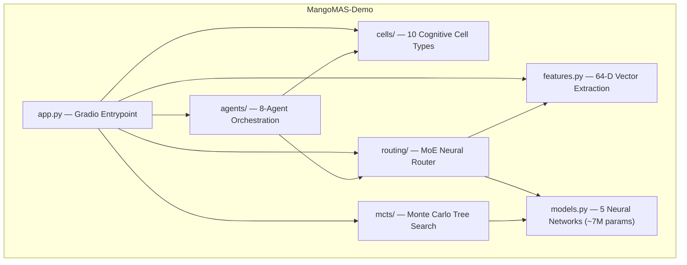

# 🥭 MangoMAS Demo

> **Multi-Agent Cognitive Architecture** — 10 Cognitive Cells · MCTS Planning · 7M MoE Router · 8-Agent Orchestration

[](https://github.com/Mango-Metrics-NLM/MangoMas-Demo/actions)
[]()
[]()
[](https://huggingface.co/spaces/Mango-Metrics-NLM/MangoMAS)
[](LICENSE)

---

## Architecture



## Key Features

| Component | Description | Details |
|-----------|-------------|---------|
| **Cognitive Cells** | 10 biologically-inspired processing units | Reasoning, Memory, Causal, Ethics, Empathy, Curiosity, FigLiteral, R2P, Telemetry, Aggregator |
| **MCTS Engine** | Monte Carlo Tree Search with NN priors | UCB1 & PUCT strategies, policy/value networks |
| **MoE Router** | ~7M param neural routing gate | 16 expert towers, gated aggregation, semantic keyword boosting |
| **Agent Orchestration** | 8 specialized agents | SWE, Architect, QA, Security, DevOps, Research, Performance, Docs |

## Quick Start

### Local

```bash
# Clone and install
git clone https://github.com/Mango-Metrics-NLM/MangoMas-Demo.git
cd MangoMas-Demo
pip install -e ".[dev]"

# Run the demo
python app.py
# → Open http://localhost:7860
```

### Docker

```bash
docker build -t mangomas-demo .
docker run -p 7860:7860 mangomas-demo
```

## Development

```bash
# Install dev dependencies
pip install -e ".[dev]"

# Run tests with coverage
pytest --cov=mangomas_demo --cov-report=term-missing

# Lint & type check
ruff check mangomas_demo/ tests/
mypy mangomas_demo/
```

## Project Structure

```
MangoMas-Demo/
├── app.py                     # Gradio entrypoint (~15 lines)
├── mangomas_demo/
│   ├── __init__.py            # Package exports
│   ├── features.py            # 64-dim feature extraction
│   ├── models.py              # ExpertTower, MoE7M, RouterNet, Policy/ValueNet
│   ├── cells/                 # 10 cognitive cell implementations
│   ├── mcts/                  # MCTS engine, benchmark, visualization
│   ├── routing/               # MoE neural router
│   ├── agents/                # Multi-agent orchestrator
│   └── ui/                    # Gradio UI builder
├── tests/                     # 80%+ coverage test suite
├── .github/workflows/         # CI/CD pipelines
├── docs/                      # Blog posts & architecture
├── Dockerfile
└── pyproject.toml
```

## Technical Blog Posts

1. **[Building Biologically-Inspired Cognitive Cells](docs/blog/)** — Architecture of the 10-cell system
2. **[MCTS for Task Planning](docs/blog/)** — Neural-guided Monte Carlo Tree Search
3. **[7M-Param MoE Routing](docs/blog/)** — Mixture-of-Experts at inference time

## Citation

```bibtex
@software{mangomas_demo_2026,
  author = {Cruickshank, Ian},
  title = {{MangoMAS}: Multi-Agent Cognitive Architecture Demo},
  year = {2026},
  url = {https://github.com/Mango-Metrics-NLM/MangoMas-Demo}
}
```

## License

[MIT](LICENSE) © 2026 Ian Cruickshank / Mango-Metrics-NLM
