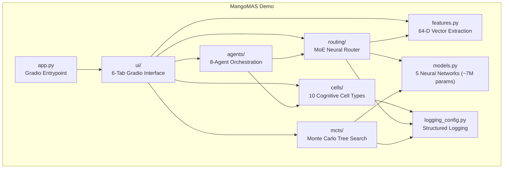

# MangoMAS Demo

**Multi-Agent Cognitive Architecture**

[](https://github.com/Mango-Metrics-NLM/MangoMas-Demo/actions/workflows/ci.yml)
[](https://github.com/Mango-Metrics-NLM/MangoMas-Demo)
[](https://www.python.org/downloads/)
[](https://huggingface.co/spaces/Mango-Metrics-NLM/MangoMAS)
[](LICENSE)
[](Dockerfile)
[](https://github.com/Mango-Metrics-NLM/MangoMas-Demo)

---

## Table of Contents

- [Overview](#overview)
- [Architecture](#architecture)
- [Key Features](#key-features)
- [Quick Start](#quick-start)
- [API Reference](#api-reference)
- [Configuration](#configuration)
- [Development](#development)
- [Project Structure](#project-structure)
- [Architecture Diagrams](#architecture-diagrams)
- [Contributing](#contributing)
- [Security](#security)
- [Citation](#citation)
- [License](#license)

---

## Overview

MangoMAS Demo is an interactive, production-grade demonstration of a **Multi-Agent Cognitive Architecture** built on composable neural components. It combines 10 biologically-inspired Cognitive Cells, a Monte Carlo Tree Search (MCTS) planning engine with neural network priors, and a ~7M parameter Mixture-of-Experts (MoE) router to orchestrate 8 specialized agents across complex task decomposition workflows.

The system is designed for researchers, AI engineers, and architects exploring multi-agent coordination, neural routing, and cognitive cell composition. The 6-tab Gradio interface provides hands-on access to every subsystem - from 64-dimensional feature extraction through cell execution pipelines to full agent orchestration - with real-time visualizations powered by Plotly.

Key differentiators include deterministic reproducibility via fixed-seed singleton routing, graceful CPU fallback when PyTorch GPU is unavailable, privacy-preserving PII detection in the Ethics cell, and a modular architecture where every component can be used independently via a clean Python API or composed into arbitrary pipelines.

---

## Architecture



---

## Key Features

| Component | Description | Details |
|---|---|---|
| **Cognitive Cells** | 10 biologically-inspired processing units | **Reasoning** (rule/NN heads), **Memory** (privacy-preserving preference extraction), **Causal** (do-calculus inference), **Ethics** (PII detection and redaction), **Empathy** (keyword emotion detection), **Curiosity** (topic-aware question generation), **FigLiteral** (figurative/literal classification), **R2P** (requirements-to-plan decomposition), **Telemetry** (event parsing), **Aggregator** (multi-expert weighted aggregation) |
| **MCTS Engine** | Monte Carlo Tree Search with neural network priors | UCB1 and PUCT selection strategies, PolicyNetwork and ValueNetwork integration, benchmark comparison (MCTS vs Greedy vs Random), sunburst tree visualization |
| **MoE Router** | ~7M parameter neural routing gate | 16 expert towers, gating network (64 to 512 to N), semantic keyword boosting, top-K selection, deterministic routing via fixed-seed singleton |
| **Agent Orchestration** | 8 specialized agents with learned routing | SWE, Architect, QA, Security, DevOps, Research, Performance, Docs agents; 3 strategies (moe_routing, round_robin, random); agent-to-cell mapping |
| **Feature Extraction** | 64-dimensional vector encoding | 32 hash sinusoidal + 16 domain tags + 8 structural + 4 sentiment + 4 novelty dimensions, L2-normalized to unit length |
| **Neural Networks** | 5 PyTorch models with CPU fallback | ExpertTower (64-512-512-256), MixtureOfExperts7M (~7M params, 16 experts), RouterNet (64-128-64-N), PolicyNetwork (128-256-128-N), ValueNetwork (192-256-64-1) |
| **Interactive Demo** | 6-tab Gradio interface | Feature Extraction, Cognitive Cells, Cell Composition, MCTS Planning, MoE Router, Agent Orchestration - all with real-time Plotly visualizations |

---

## Quick Start

### Live Demo

Try MangoMAS instantly on HuggingFace Spaces - no installation required:

> **[https://huggingface.co/spaces/Mango-Metrics-NLM/MangoMAS](https://huggingface.co/spaces/Mango-Metrics-NLM/MangoMAS)**

### Local Installation

```bash
git clone https://github.com/Mango-Metrics-NLM/MangoMas-Demo.git
cd MangoMas-Demo
pip install -e ".[dev]"

python app.py
# Open http://localhost:7860
```

### Docker

```bash
docker build -t mangomas-demo .
docker run -p 7860:7860 mangomas-demo
```

The container includes a health check that validates the package imports correctly.

---

## API Reference

All public functions are re-exported from the top-level `mangomas_demo` package for convenient access.

### featurize64 - Feature Extraction

Extract a deterministic 64-dimensional feature vector from text input.

```python
from mangomas_demo import featurize64

vector = featurize64("Design a secure API gateway with rate limiting")
print(len(vector))   # 64
print(type(vector))  # <class 'list'>
```

### execute_cell - Cognitive Cell Execution

Execute any of the 10 cognitive cell types with optional JSON configuration.

```python
from mangomas_demo import execute_cell

result = execute_cell("ethics", "Contact john@example.com for details")
print(result["is_safe"])        # False
print(result["redacted_text"])  # Contact [REDACTED] for details

result = execute_cell("reasoning", "Analyze this problem", '{"head_type": "nn"}')
print(result["head_type"])      # nn
print(result["section_count"])  # number of reasoning sections
```

### run_mcts - MCTS Planning

Run Monte Carlo Tree Search on a task with configurable strategy and simulation count.

```python
from mangomas_demo import run_mcts

result = run_mcts(
    task="Design a microservices architecture",
    max_simulations=200,
    exploration_constant=1.414,
    strategy="ucb1",  # or "puct"
)
print(result["best_action"])       # e.g., "service_split"
print(result["best_value"])        # e.g., 0.672
print(result["nn_enabled"])        # True if PyTorch available
print(result["total_simulations"]) # 200
```

### route_task - MoE Neural Routing

Route a task to the top-K most relevant experts via the neural MoE gate.

```python
from mangomas_demo import route_task

result = route_task("Implement JWT authentication", top_k=3)
for expert in result["selected_experts"]:
    print(f"{expert['rank']}. {expert['expert']} (weight={expert['weight']})")
# 1. Security Expert (weight=0.2341)
# 2. Code Expert (weight=0.1987)
# 3. Architecture Expert (weight=0.1456)
```

### orchestrate - Agent Orchestration

Orchestrate multiple agents for a task using one of three routing strategies.

```python
from mangomas_demo import orchestrate

result = orchestrate(
    task="Build a REST API with authentication and tests",
    max_agents=3,
    strategy="moe_routing",  # or "round_robin", "random"
)
print(result["agents_selected"])    # 3
print(result["total_elapsed_ms"])   # e.g., 12.45
for agent_result in result["results"]:
    print(f"{agent_result['agent']}: cell={agent_result['cell_used']}")
```

### compose_cells - Cell Pipeline Composition

Execute a sequential pipeline of cognitive cells on the same input.

```python
from mangomas_demo import compose_cells

result = compose_cells("reasoning, ethics, causal", "Evaluate this security report")
print(result["total_cells"])    # 3
print(result["pipeline"])       # ["reasoning", "ethics", "causal"]
for activation in result["activations"]:
    print(f"{activation['cell_type']}: {activation['status']} ({activation['elapsed_ms']}ms)")
```

---

## Configuration

MangoMAS logging is configured entirely through environment variables. The logging system initializes automatically on package import.

| Variable | Description | Default | Options |
|---|---|---|---|
| `MANGOMAS_LOG_LEVEL` | Root log level for the `mangomas_demo` logger | `INFO` | `DEBUG`, `INFO`, `WARNING`, `ERROR`, `CRITICAL` |
| `MANGOMAS_LOG_FORMAT` | Output format for log records | `text` | `text` (human-readable), `json` (structured) |

```bash
# Enable debug logging with JSON output
export MANGOMAS_LOG_LEVEL=DEBUG
export MANGOMAS_LOG_FORMAT=json
python app.py
```

The JSON format outputs structured log records with `timestamp`, `level`, `logger`, `message`, and optional fields (`component`, `elapsed_ms`, `cell_type`, `strategy`) when present.

---

## Development

### Setup

```bash
git clone https://github.com/Mango-Metrics-NLM/MangoMas-Demo.git
cd MangoMas-Demo
pip install -e ".[dev]"
```

### Testing

The test suite enforces a minimum of 80% code coverage.

```bash
# Run full test suite with coverage
pytest --cov=mangomas_demo --cov-report=term-missing --cov-fail-under=80

# Run specific test categories
pytest tests/unit/             # Unit tests
pytest tests/integration/      # Integration tests
pytest tests/sanity/           # Sanity checks
pytest tests/security/         # Security tests

# Parallel execution
pytest -n auto --cov=mangomas_demo
```

### Linting

```bash
ruff check mangomas_demo/ tests/
```

### Type Checking

```bash
mypy mangomas_demo/
```

Mypy is configured in strict mode with `disallow_untyped_defs`, `warn_return_any`, and `warn_unused_configs` enabled. Third-party type stubs for `torch`, `gradio`, and `plotly` are excluded via overrides.

---

## Project Structure

```
MangoMas-Demo/
├── app.py                              # Gradio entrypoint
├── mangomas_demo/
│   ├── __init__.py                     # Package exports and auto-configured logging
│   ├── features.py                     # 64-dim feature extraction (featurize64, plot_features)
│   ├── models.py                       # ExpertTower, MixtureOfExperts7M, RouterNet, PolicyNetwork, ValueNetwork
│   ├── logging_config.py              # Structured logging (text/JSON), env-driven config
│   ├── cells/
│   │   ├── __init__.py                # Re-exports: execute_cell, compose_cells, CELL_TYPES
│   │   ├── types.py                   # 10 cognitive cell type registry
│   │   └── executor.py               # Cell dispatch and execution logic
│   ├── mcts/
│   │   ├── __init__.py
│   │   ├── engine.py                  # MCTSNode, run_mcts (UCB1/PUCT)
│   │   ├── benchmark.py              # benchmark_strategies (MCTS vs Greedy vs Random)
│   │   └── viz.py                     # Sunburst tree visualization
│   ├── routing/
│   │   ├── __init__.py
│   │   ├── router.py                  # route_task, singleton RouterNet, keyword boosting
│   │   └── viz.py                     # Expert weight visualization
│   ├── agents/
│   │   ├── __init__.py
│   │   └── orchestrator.py           # orchestrate, 8 agents, 3 strategies
│   └── ui/
│       ├── __init__.py
│       ├── builder.py                 # 6-tab Gradio app builder
│       └── styles.py                  # Theme CSS
├── tests/
│   ├── conftest.py                    # Shared fixtures
│   ├── unit/
│   │   ├── test_cells.py
│   │   ├── test_features.py
│   │   ├── test_logging.py
│   │   ├── test_mcts.py
│   │   ├── test_models.py
│   │   └── test_routing.py
│   ├── integration/
│   │   └── test_pipeline.py
│   ├── sanity/
│   │   ├── test_sanity.py
│   │   ├── test_docs.py
│   │   └── test_notebook.py
│   └── security/
│       └── test_security.py
├── .github/
│   └── workflows/
│       ├── ci.yml                     # Lint, type check, test (Python 3.11/3.12), build
│       └── cd.yml                     # Continuous deployment
├── docs/
│   └── architecture/
│       ├── c4-context.md              # C4 Level 1 - System Context
│       ├── c4-container.md            # C4 Level 2 - Container diagram
│       ├── c4-component.md            # C4 Level 3 - Component diagram
│       ├── c4-code.md                 # C4 Level 4 - Code-level class diagrams
│       ├── data-flow.md               # Data flow sequence diagrams
│       └── deployment.md              # Deployment architecture
├── notebooks/
│   └── demo.ipynb                     # Interactive Jupyter walkthrough
├── Dockerfile                         # Python 3.11-slim with health check
├── pyproject.toml                     # Hatchling build, dependencies, tool config
├── requirements.txt                   # Pinned runtime dependencies
├── CONTRIBUTING.md                    # Contribution guidelines
├── SECURITY.md                        # Security policy
├── CHANGELOG.md
└── LICENSE                            # MIT
```

---

## Architecture Diagrams

Detailed C4 model architecture documentation is available in [docs/architecture/](docs/architecture/):

| Level | Document | Description |
|---|---|---|
| **L1 - Context** | [c4-context.md](docs/architecture/c4-context.md) | System context - MangoMAS and its external actors |
| **L2 - Container** | [c4-container.md](docs/architecture/c4-container.md) | Major containers and their interactions |
| **L3 - Component** | [c4-component.md](docs/architecture/c4-component.md) | Detailed component breakdown within each container |
| **L4 - Code** | [c4-code.md](docs/architecture/c4-code.md) | Class diagrams for neural networks, MCTSNode, cell registry |
| **Data Flow** | [data-flow.md](docs/architecture/data-flow.md) | Sequence diagrams for pipeline, MCTS, and orchestration flows |
| **Deployment** | [deployment.md](docs/architecture/deployment.md) | Deployment topology - local, Docker, HuggingFace, CI/CD |

---

## Contributing

Contributions are welcome. Please read [CONTRIBUTING.md](CONTRIBUTING.md) for guidelines on development setup, code style, testing requirements, and the pull request process.

---

## Security

For vulnerability reporting and security policy details, see [SECURITY.md](SECURITY.md).

---

## Citation

```bibtex
@software{mangomas_demo_2026,
  author       = {Cruickshank, Ian},
  title        = {{MangoMAS}: Multi-Agent Cognitive Architecture Demo},
  year         = {2026},
  publisher    = {GitHub},
  url          = {https://github.com/Mango-Metrics-NLM/MangoMas-Demo},
  note         = {10 Cognitive Cells, MCTS Planning, 7M-param MoE Router, 8-Agent Orchestration}
}
```

---

## License

[MIT](LICENSE) &copy; 2026 Ian Cruickshank / Mango-Metrics-NLM

Permission is hereby granted, free of charge, to any person obtaining a copy of this software and associated documentation files, to deal in the Software without restriction. See [LICENSE](LICENSE) for the full text.
