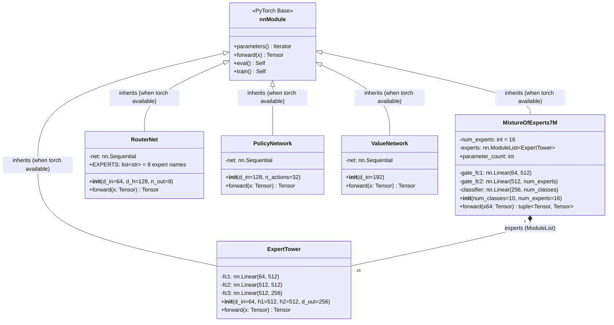
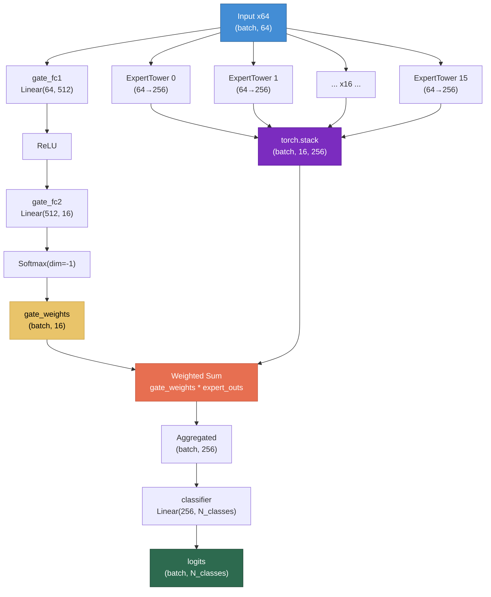
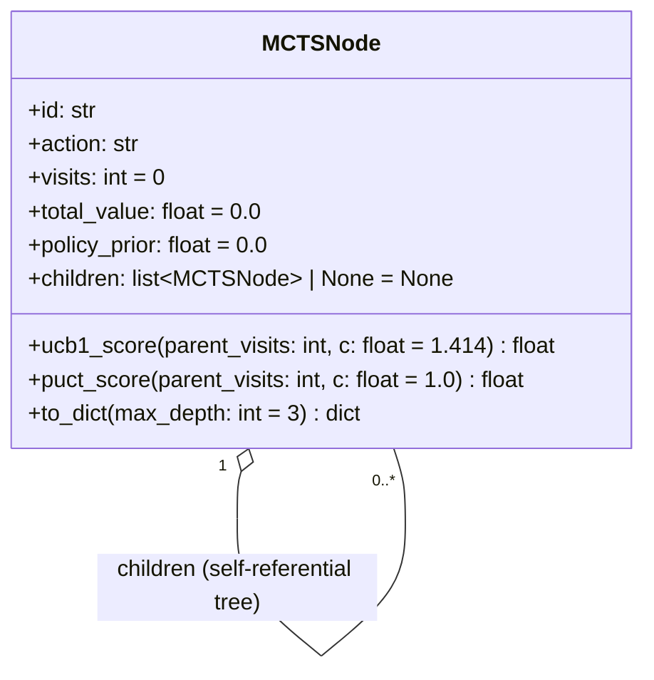
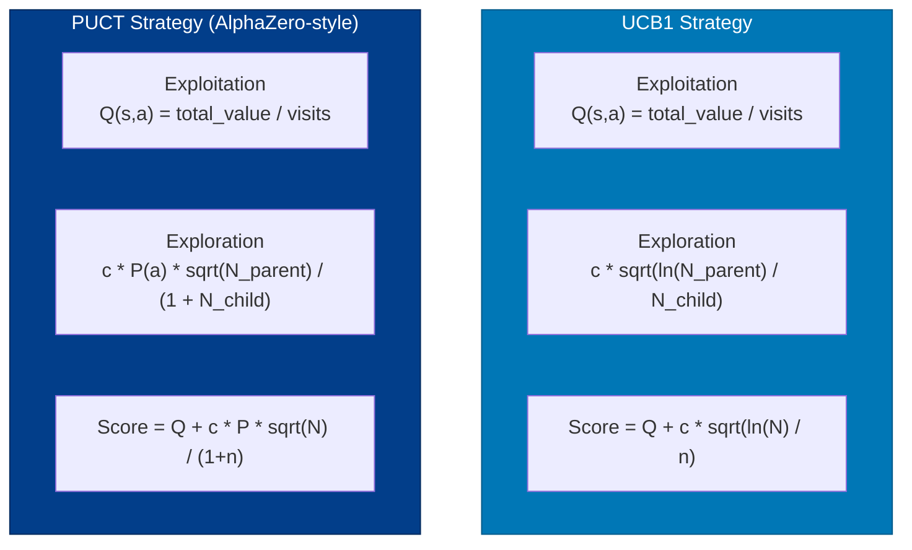
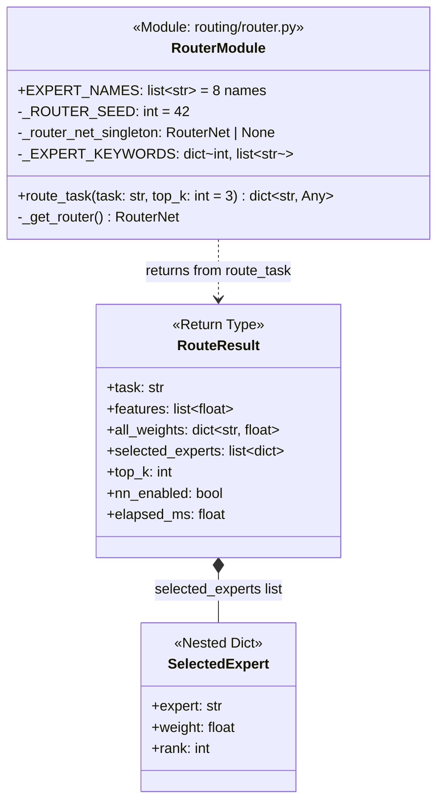
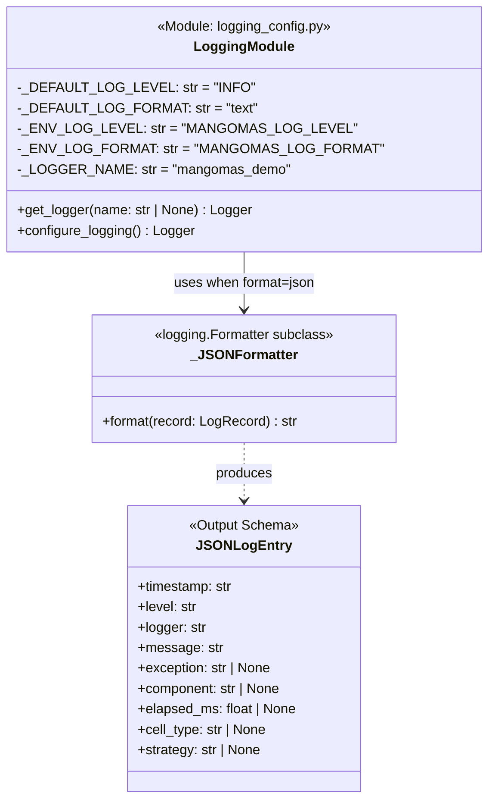
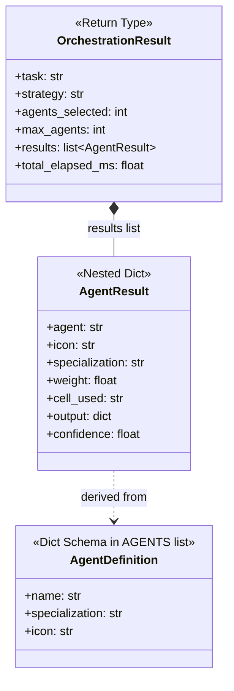

# C4 Level 4 -- Code-Level Diagrams

## Overview

The Code-level diagrams show the actual class structures, method signatures, data types, and relationships as implemented in the MangoMAS codebase. This level is derived directly from the source code and represents the finest grain of architectural detail.

## Neural Network Model Hierarchy

All five neural network classes conditionally inherit from `torch.nn.Module` (or `object` when PyTorch is unavailable). The `TORCH_AVAILABLE` boolean flag controls this at import time.



### RouterNet Internal Architecture

The `RouterNet` uses an `nn.Sequential` with three linear layers, ReLU activations, and dropout:

```mermaid
graph LR
    Input["Input<br/>64-dim"] --> L1["nn.Linear<br/>64 &rarr; 128"]
    L1 --> R1["ReLU"]
    R1 --> D1["Dropout<br/>p=0.1"]
    D1 --> L2["nn.Linear<br/>128 &rarr; 64"]
    L2 --> R2["ReLU"]
    R2 --> L3["nn.Linear<br/>64 &rarr; 8"]
    L3 --> SM["Softmax<br/>dim=-1"]
    SM --> Output["Output<br/>8-dim probs"]

    style Input fill:#438DD5,stroke:#2E6295,color:#fff
    style Output fill:#2D6A4F,stroke:#1B4332,color:#fff
    style L1 fill:#E9C46A,stroke:#C9A24A,color:#000
    style L2 fill:#E9C46A,stroke:#C9A24A,color:#000
    style L3 fill:#E9C46A,stroke:#C9A24A,color:#000
    style R1 fill:#F4A261,stroke:#D48241,color:#000
    style R2 fill:#F4A261,stroke:#D48241,color:#000
    style D1 fill:#E76F51,stroke:#C5533A,color:#fff
    style SM fill:#2A9D8F,stroke:#1E7A6E,color:#fff
```



### MixtureOfExperts7M Forward Pass



## MCTSNode Dataclass

The `MCTSNode` is a `@dataclass` that forms the tree structure for Monte Carlo Tree Search. Each node tracks visit counts, accumulated value, and an optional neural policy prior.



### UCB1 and PUCT Formulas

The two selection strategies implemented in `MCTSNode`:



## Cell Type Registry Schema

The `CELL_TYPES` dictionary in `cells/types.py` defines the 10 cognitive cell types. Each entry maps a string key to a configuration dict.

```mermaid
classDiagram
    class CELL_TYPES {
        <<Registry: dict~str, dict~>>
    }

    class CellTypeEntry {
        +name: str
        +description: str
        +heads: list~str~
    }

    class ReasoningCell {
        +name = "ReasoningCell"
        +heads = ["rule", "nn"]
        +description = "Structured reasoning with Rule or NN heads"
    }

    class MemoryCell {
        +name = "MemoryCell"
        +heads = ["preference_extractor"]
        +description = "Privacy-preserving preference extraction"
    }

    class CausalCell {
        +name = "CausalCell"
        +heads = ["do_calculus"]
        +description = "Pearl's do-calculus for causal inference"
    }

    class EthicsCell {
        +name = "EthicsCell"
        +heads = ["classifier", "pii_scanner"]
        +description = "Safety classification and PII detection"
    }

    class EmpathyCell {
        +name = "EmpathyCell"
        +heads = ["tone_detector"]
        +description = "Emotional tone detection and empathetic responses"
    }

    class CuriosityCell {
        +name = "CuriosityCell"
        +heads = ["hypothesis_generator"]
        +description = "Epistemic curiosity and hypothesis generation"
    }

    class FigLiteralCell {
        +name = "FigLiteralCell"
        +heads = ["classifier"]
        +description = "Figurative vs literal language classification"
    }

    class R2PCell {
        +name = "R2PCell"
        +heads = ["planner"]
        +description = "Requirements-to-Plan structured decomposition"
    }

    class TelemetryCell {
        +name = "TelemetryCell"
        +heads = ["collector"]
        +description = "Telemetry event capture and structuring"
    }

    class AggregatorCell {
        +name = "AggregatorCell"
        +heads = ["weighted_average", "max_confidence", "ensemble"]
        +description = "Multi-expert output aggregation"
    }

    CELL_TYPES --> CellTypeEntry : schema
    CellTypeEntry <|-- ReasoningCell
    CellTypeEntry <|-- MemoryCell
    CellTypeEntry <|-- CausalCell
    CellTypeEntry <|-- EthicsCell
    CellTypeEntry <|-- EmpathyCell
    CellTypeEntry <|-- CuriosityCell
    CellTypeEntry <|-- FigLiteralCell
    CellTypeEntry <|-- R2PCell
    CellTypeEntry <|-- TelemetryCell
    CellTypeEntry <|-- AggregatorCell
```



## Executor Function Signatures

The `cells/executor.py` module exposes two public functions and 10 private handler functions:

```mermaid
classDiagram
    class CellExecutor {
        <<Module: cells/executor.py>>
        +execute_cell(cell_type: str, text: str, config_json: str = "{}") dict~str, Any~
        +compose_cells(pipeline_str: str, text: str) dict~str, Any~
        -_execute_reasoning(result: dict, text: str, config: dict) None
        -_execute_memory(result: dict, text: str) None
        -_execute_causal(result: dict, text: str, config: dict) None
        -_execute_ethics(result: dict, text: str) None
        -_execute_empathy(result: dict, text: str) None
        -_execute_curiosity(result: dict, text: str, config: dict) None
        -_execute_figliteral(result: dict, text: str) None
        -_execute_r2p(result: dict) None
        -_execute_telemetry(result: dict, text: str) None
        -_execute_aggregator(result: dict, text: str, config: dict) None
    }

    class CellResult {
        <<Return Type>>
        +cell_type: str
        +request_id: str
        +status: str
        +elapsed_ms: float
        +... cell-specific fields
    }

    class PipelineResult {
        <<Return Type>>
        +pipeline: list~str~
        +activations: list~dict~
        +final_output: dict
        +total_cells: int
        +context_keys: list~str~
    }

    CellExecutor ..> CellResult : returns from execute_cell
    CellExecutor ..> PipelineResult : returns from compose_cells
```

## Routing Module Internals



## Logging Configuration Classes



## Agent Orchestration Types


