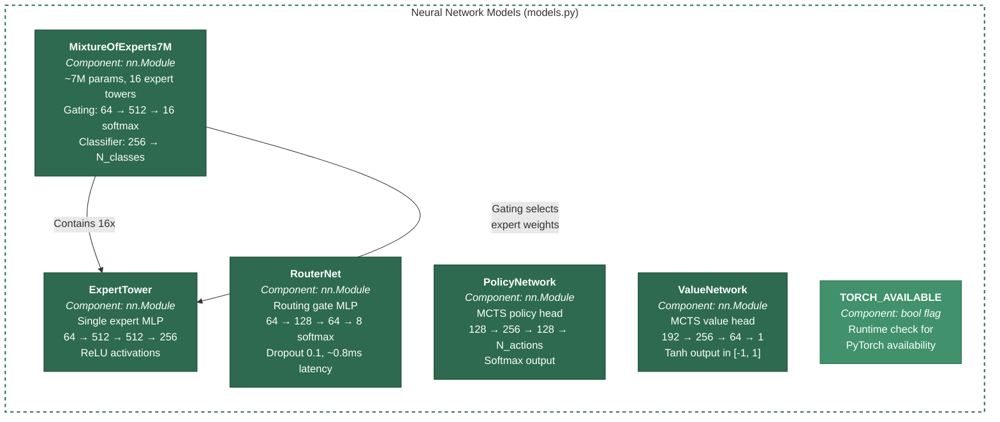
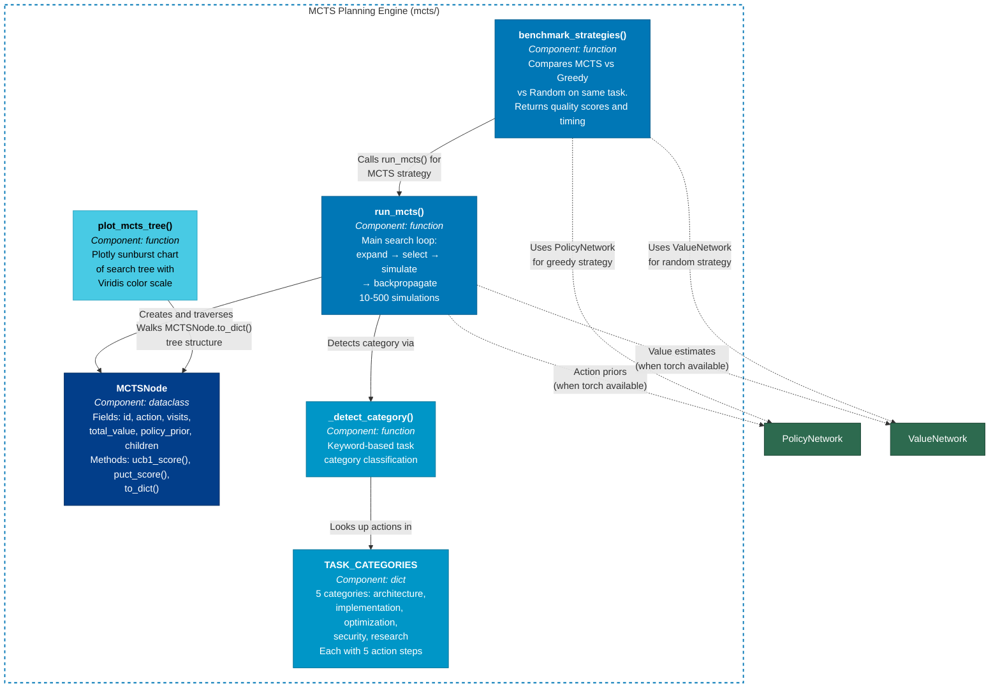
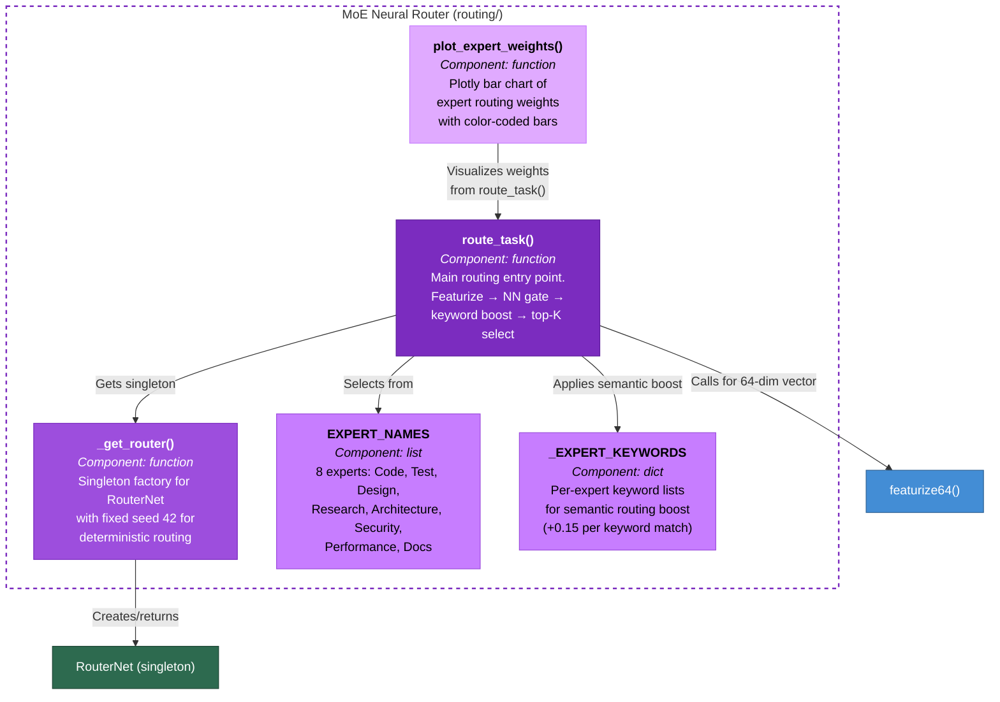
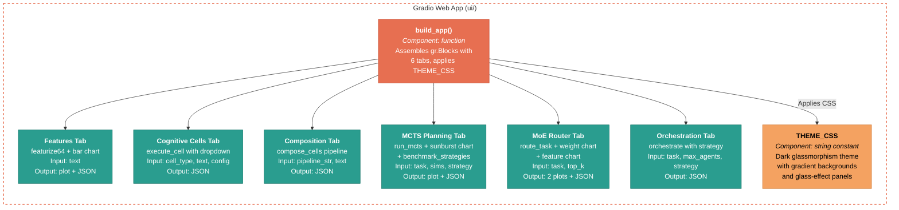
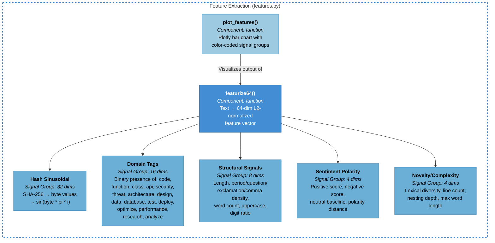
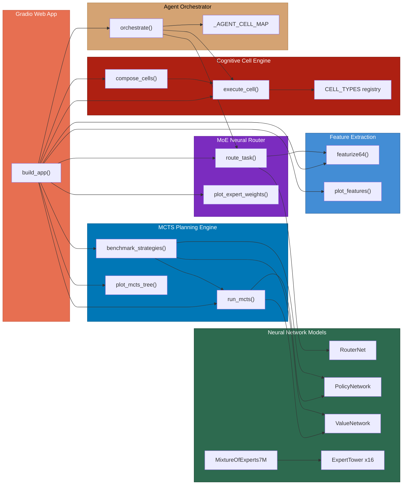

# C4 Level 3 -- Component Diagram

## Overview

The Component diagram drills into each container to reveal the internal components -- the individual classes, functions, registries, and visualizations that make up the MangoMAS system. This level shows all 10 cognitive cell types, all 5 neural network models, all 8 agents, and all MCTS/routing components with their dependencies.

## Neural Network Models Container

The `models.py` module defines five `nn.Module` subclasses (with graceful `object` fallback) that power the MoE routing, MCTS planning, and expert classification subsystems.

## Cognitive Cell Engine Container

The cell engine consists of a type registry (`types.py`) and an executor (`executor.py`) with 10 private handler functions, plus a composition pipeline.

```mermaid
graph TB
    subgraph CellsContainer["Cognitive Cell Engine (cells/)"]
        direction TB

        Registry["<b>CELL_TYPES Registry</b><br/><i>Component: dict</i><br/>10 cell type definitions<br/>with names, descriptions,<br/>and available heads"]

        Executor["<b>execute_cell()</b><br/><i>Component: function</i><br/>Dispatches to cell-specific<br/>handler by cell_type string.<br/>Lifecycle: validate &rarr; infer<br/>&rarr; structure &rarr; return"]

        Composer["<b>compose_cells()</b><br/><i>Component: function</i><br/>Sequential multi-cell pipeline.<br/>Comma-separated cell types,<br/>accumulates context dict"]

        R1["<b>ReasoningCell</b><br/><i>heads: rule, nn</i><br/>Structured reasoning<br/>with boundary detection"]

        R2["<b>MemoryCell</b><br/><i>heads: preference_extractor</i><br/>Privacy-preserving<br/>preference extraction"]

        R3["<b>CausalCell</b><br/><i>heads: do_calculus</i><br/>Pearl's do-calculus for<br/>causal inference"]

        R4["<b>EthicsCell</b><br/><i>heads: classifier, pii_scanner</i><br/>Safety classification<br/>and PII detection/redaction"]

        R5["<b>EmpathyCell</b><br/><i>heads: tone_detector</i><br/>Emotional tone detection<br/>with empathetic responses"]

        R6["<b>CuriosityCell</b><br/><i>heads: hypothesis_generator</i><br/>Epistemic curiosity and<br/>question generation"]

        R7["<b>FigLiteralCell</b><br/><i>heads: classifier</i><br/>Figurative vs literal<br/>language classification"]

        R8["<b>R2PCell</b><br/><i>heads: planner</i><br/>Requirements-to-Plan<br/>structured decomposition"]

        R9["<b>TelemetryCell</b><br/><i>heads: collector</i><br/>Telemetry event capture,<br/>action/duration/page parsing"]

        R10["<b>AggregatorCell</b><br/><i>heads: weighted_average,<br/>max_confidence, ensemble</i><br/>Multi-expert output aggregation"]
    end

    Executor -->|"Dispatches to"| R1
    Executor -->|"Dispatches to"| R2
    Executor -->|"Dispatches to"| R3
    Executor -->|"Dispatches to"| R4
    Executor -->|"Dispatches to"| R5
    Executor -->|"Dispatches to"| R6
    Executor -->|"Dispatches to"| R7
    Executor -->|"Dispatches to"| R8
    Executor -->|"Dispatches to"| R9
    Executor -->|"Dispatches to"| R10

    Composer -->|"Calls sequentially"| Executor
    Executor -->|"Validates against"| Registry
    R10 -->|"Aggregates output from<br/>other cells (no recursion)"| Executor

    style Registry fill:#9B2226,stroke:#6B1518,color:#fff
    style Executor fill:#AE2012,stroke:#7A160D,color:#fff
    style Composer fill:#AE2012,stroke:#7A160D,color:#fff
    style R1 fill:#CA6702,stroke:#9A4E01,color:#fff
    style R2 fill:#CA6702,stroke:#9A4E01,color:#fff
    style R3 fill:#CA6702,stroke:#9A4E01,color:#fff
    style R4 fill:#CA6702,stroke:#9A4E01,color:#fff
    style R5 fill:#CA6702,stroke:#9A4E01,color:#fff
    style R6 fill:#CA6702,stroke:#9A4E01,color:#fff
    style R7 fill:#CA6702,stroke:#9A4E01,color:#fff
    style R8 fill:#CA6702,stroke:#9A4E01,color:#fff
    style R9 fill:#CA6702,stroke:#9A4E01,color:#fff
    style R10 fill:#CA6702,stroke:#9A4E01,color:#fff
    style CellsContainer fill:none,stroke:#AE2012,stroke-width:2px,stroke-dasharray:5
```

## MCTS Planning Engine Container

The MCTS engine implements Monte Carlo Tree Search with two selection strategies and integrates optional neural network priors for policy and value estimation.

## MoE Neural Router Container

The routing subsystem combines neural network gating with keyword-based semantic boosting to select top-K experts for a given task.

## Agent Orchestrator Container

The orchestrator coordinates 8 specialized agents, mapping each to a cognitive cell type and supporting three routing strategies.

```mermaid
graph TB
    subgraph OrchestratorContainer["Agent Orchestrator (agents/)"]
        direction TB

        Orchestrate["<b>orchestrate()</b><br/><i>Component: function</i><br/>Entry point: selects agents<br/>by strategy, executes cells,<br/>collects results"]

        MoEStrat["<b>_orchestrate_moe()</b><br/><i>Component: function</i><br/>Uses route_task() for<br/>neural expert selection"]

        RRStrat["<b>_orchestrate_round_robin()</b><br/><i>Component: function</i><br/>Sequential selection<br/>AGENTS[:max_agents]"]

        RandStrat["<b>_orchestrate_random()</b><br/><i>Component: function</i><br/>Random sampling from<br/>agent pool"]

        CellMap["<b>_AGENT_CELL_MAP</b><br/><i>Component: dict</i><br/>Agent &rarr; Cell mapping:<br/>SWE &rarr; reasoning<br/>Architect &rarr; r2p<br/>QA &rarr; reasoning<br/>Security &rarr; ethics<br/>DevOps &rarr; telemetry<br/>Research &rarr; causal<br/>Performance &rarr; reasoning<br/>Documentation &rarr; reasoning"]

        A1["<b>SWE Agent</b><br/>Code scaffold generation"]
        A2["<b>Architect Agent</b><br/>System design and patterns"]
        A3["<b>QA Agent</b><br/>Test plan and case generation"]
        A4["<b>Security Agent</b><br/>Threat modeling - OWASP"]
        A5["<b>DevOps Agent</b><br/>Infrastructure planning"]
        A6["<b>Research Agent</b><br/>Technical analysis"]
        A7["<b>Performance Agent</b><br/>Optimization analysis"]
        A8["<b>Documentation Agent</b><br/>Technical writing"]
    end

    Orchestrate -->|"strategy: moe_routing"| MoEStrat
    Orchestrate -->|"strategy: round_robin"| RRStrat
    Orchestrate -->|"strategy: random"| RandStrat

    MoEStrat -->|"Maps expert to agent"| A1
    MoEStrat -->|"Maps expert to agent"| A2
    MoEStrat -->|"Maps expert to agent"| A3
    MoEStrat -->|"Maps expert to agent"| A4
    MoEStrat -->|"Maps expert to agent"| A5
    MoEStrat -->|"Maps expert to agent"| A6
    MoEStrat -->|"Maps expert to agent"| A7
    MoEStrat -->|"Maps expert to agent"| A8

    CellMap -->|"Resolves cell type<br/>for each agent"| Orchestrate

    RT_ext["route_task()"]
    EC_ext["execute_cell()"]

    MoEStrat -->|"Calls for expert selection"| RT_ext
    MoEStrat -->|"Executes mapped cell"| EC_ext
    RRStrat -->|"Executes mapped cell"| EC_ext
    RandStrat -->|"Executes mapped cell"| EC_ext

    style Orchestrate fill:#D4A373,stroke:#B08451,color:#000
    style MoEStrat fill:#E9C46A,stroke:#C9A24A,color:#000
    style RRStrat fill:#E9C46A,stroke:#C9A24A,color:#000
    style RandStrat fill:#E9C46A,stroke:#C9A24A,color:#000
    style CellMap fill:#F4A261,stroke:#D48241,color:#000
    style A1 fill:#264653,stroke:#1A3040,color:#fff
    style A2 fill:#264653,stroke:#1A3040,color:#fff
    style A3 fill:#264653,stroke:#1A3040,color:#fff
    style A4 fill:#264653,stroke:#1A3040,color:#fff
    style A5 fill:#264653,stroke:#1A3040,color:#fff
    style A6 fill:#264653,stroke:#1A3040,color:#fff
    style A7 fill:#264653,stroke:#1A3040,color:#fff
    style A8 fill:#264653,stroke:#1A3040,color:#fff
    style RT_ext fill:#7B2CBF,stroke:#5A189A,color:#fff
    style EC_ext fill:#AE2012,stroke:#7A160D,color:#fff
    style OrchestratorContainer fill:none,stroke:#D4A373,stroke-width:2px,stroke-dasharray:5
```

## Gradio Web App Container

The UI container assembles six interactive tabs, each wired to the corresponding backend containers.

## Feature Extraction Container

The feature extraction module produces the 64-dimensional vectors that serve as the universal input representation for the neural models and router.

## Full System Component Interaction

This diagram shows how the major components across all containers connect at the function-call level.

