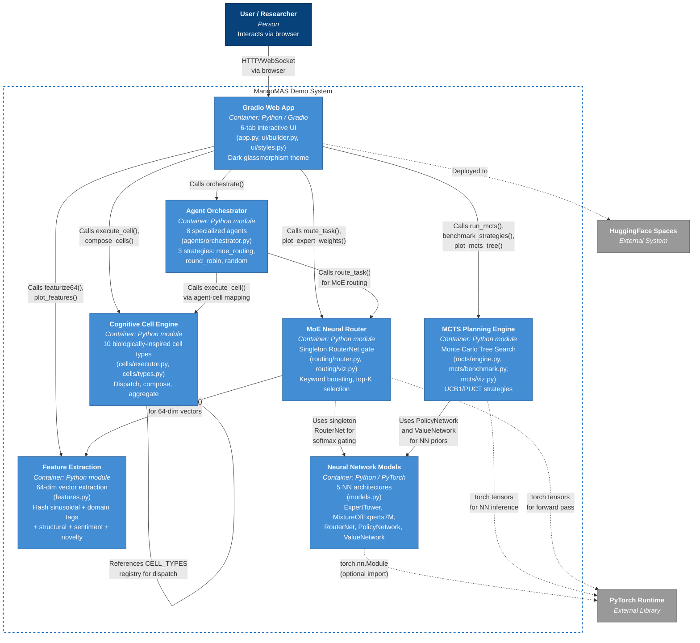

# C4 Level 2 -- Container Diagram

## Overview

The Container diagram zooms into the MangoMAS Demo system boundary and reveals the seven major containers (deployable/runnable units) that comprise the architecture. Each container represents a distinct area of responsibility within the `mangomas_demo` Python package, connected by in-process Python calls.

## Container Diagram

## Container Descriptions

| Container | Technology | Source Files | Purpose |
|-----------|-----------|--------------|---------|
| **Gradio Web App** | Python, Gradio, Plotly | `app.py`, `ui/builder.py`, `ui/styles.py` | Entrypoint and 6-tab interactive interface. Builds UI with `build_app()`, applies dark glassmorphism CSS theme, launches on port 7860 |
| **Feature Extraction** | Python, hashlib, math | `features.py` | Extracts deterministic 64-dimensional L2-normalized feature vectors from text. Five signal groups: 32 hash sinusoidal, 16 domain tags, 8 structural, 4 sentiment, 4 novelty |
| **Neural Network Models** | Python, PyTorch (optional) | `models.py` | Five `nn.Module` subclasses with graceful fallback to `object` when PyTorch is unavailable. Defines `ExpertTower` (64-512-512-256), `MixtureOfExperts7M` (~7M params, 16 experts), `RouterNet` (64-128-64-8), `PolicyNetwork` (128-256-128-N), `ValueNetwork` (192-256-64-1) |
| **Cognitive Cell Engine** | Python | `cells/types.py`, `cells/executor.py` | Registry of 10 cell types with dispatch via `execute_cell()`. Supports pipeline composition via `compose_cells()`. Lifecycle: validate, infer, structure, return |
| **MCTS Planning Engine** | Python, PyTorch (optional) | `mcts/engine.py`, `mcts/benchmark.py`, `mcts/viz.py` | Monte Carlo Tree Search with `MCTSNode` dataclass, UCB1 and PUCT selection strategies, optional PolicyNetwork/ValueNetwork priors, sunburst Plotly visualization, and strategy benchmarking (MCTS vs Greedy vs Random) |
| **MoE Neural Router** | Python, NumPy, PyTorch (optional) | `routing/router.py`, `routing/viz.py` | Singleton `RouterNet` with fixed seed (42) for deterministic routing. Applies semantic keyword boosting to expert weights, selects top-K experts, generates bar chart visualizations |
| **Agent Orchestrator** | Python | `agents/orchestrator.py` | Defines 8 specialized agents (SWE, Architect, QA, Security, DevOps, Research, Performance, Documentation) with agent-to-cell mapping. Three routing strategies: `moe_routing` (neural gate), `round_robin` (sequential), `random` |

## Inter-Container Communication

All communication between containers occurs as **in-process Python function calls** -- there are no network boundaries between containers. The system runs as a single Python process:

1. **UI to Feature Extraction**: `featurize64(text)` returns a `list[float]` of 64 values; `plot_features(features)` returns a Plotly `Figure`.
2. **UI to Cognitive Cells**: `execute_cell(cell_type, text, config_json)` returns a `dict`; `compose_cells(pipeline_str, text)` chains multiple cells sequentially.
3. **UI to MCTS**: `run_mcts(task, max_simulations, exploration_constant, strategy)` returns a dict with the search tree and best action.
4. **UI to Router**: `route_task(task, top_k)` returns routing weights and selected experts.
5. **UI to Orchestrator**: `orchestrate(task, max_agents, strategy)` returns a dict with per-agent results.
6. **Router to Features**: The router internally calls `featurize64(task)` to produce the 64-dim input vector.
7. **Router to Models**: The router uses the singleton `RouterNet` for softmax gating over 8 experts.
8. **MCTS to Models**: The engine uses `PolicyNetwork` for action priors and `ValueNetwork` for state evaluation.
9. **Orchestrator to Router**: When using `moe_routing` strategy, the orchestrator calls `route_task()` for expert selection.
10. **Orchestrator to Cells**: Each selected agent maps to a cell type via `_AGENT_CELL_MAP` and executes through `execute_cell()`.
