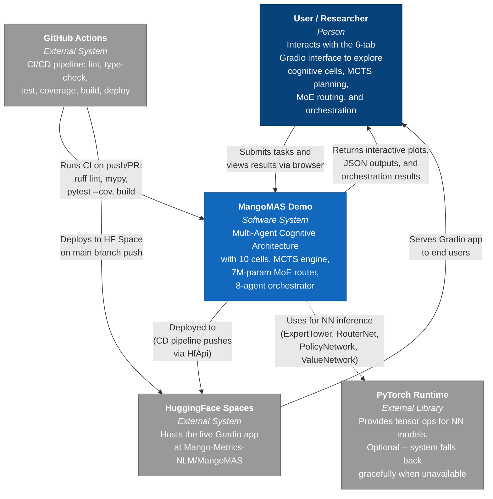

# C4 Level 1 -- System Context Diagram

## Overview

The System Context diagram shows MangoMAS Demo as a single system and its relationships with the users and external systems it interacts with. MangoMAS is a Python-based Multi-Agent Cognitive Architecture that combines neural network routing, Monte Carlo Tree Search planning, and a pipeline of 10 cognitive cell types -- all exposed through an interactive Gradio web interface.

## System Context Diagram

## Element Descriptions

| Element | Type | Description |
|---------|------|-------------|
| **User / Researcher** | Person | Data scientists, ML engineers, or researchers who interact with the Gradio web UI to explore multi-agent cognitive architecture features |
| **MangoMAS Demo** | Software System | The core application -- a Python package (`mangomas_demo`) providing feature extraction, neural models, cognitive cells, MCTS planning, MoE routing, and multi-agent orchestration |
| **HuggingFace Spaces** | External System | Cloud hosting platform where the Gradio application is deployed and served publicly at `Mango-Metrics-NLM/MangoMAS` |
| **GitHub Actions** | External System | CI/CD automation running two workflows: `ci.yml` (lint, type-check, test with coverage, build) and `cd.yml` (deploy to HuggingFace Space) |
| **PyTorch Runtime** | External Library | Optional deep learning framework. When available, provides real neural network inference for the 5 NN models. When absent, the system uses deterministic fallback logic |

## Key Interactions

1. **User to MangoMAS**: The user submits natural language tasks through the Gradio 6-tab UI (Features, Cells, Composition, MCTS, Router, Orchestration). The system processes inputs through the feature extraction and cognitive pipeline, returning structured JSON results and interactive Plotly visualizations.

2. **MangoMAS to HuggingFace**: The CD pipeline (`cd.yml`) uses `huggingface_hub.HfApi.upload_folder()` to push the application code to the HuggingFace Space on every push to `main`.

3. **GitHub Actions to MangoMAS**: On every pull request and push to `main`, the CI pipeline runs Ruff linting, Mypy strict type checking, pytest with 80% minimum coverage, and a package build verification step.

4. **MangoMAS to PyTorch**: All five neural network classes (`ExpertTower`, `MixtureOfExperts7M`, `RouterNet`, `PolicyNetwork`, `ValueNetwork`) conditionally import `torch` and `torch.nn`. If PyTorch is unavailable, models inherit from `object` instead of `nn.Module`, and routing/MCTS engines use deterministic fallback calculations.
