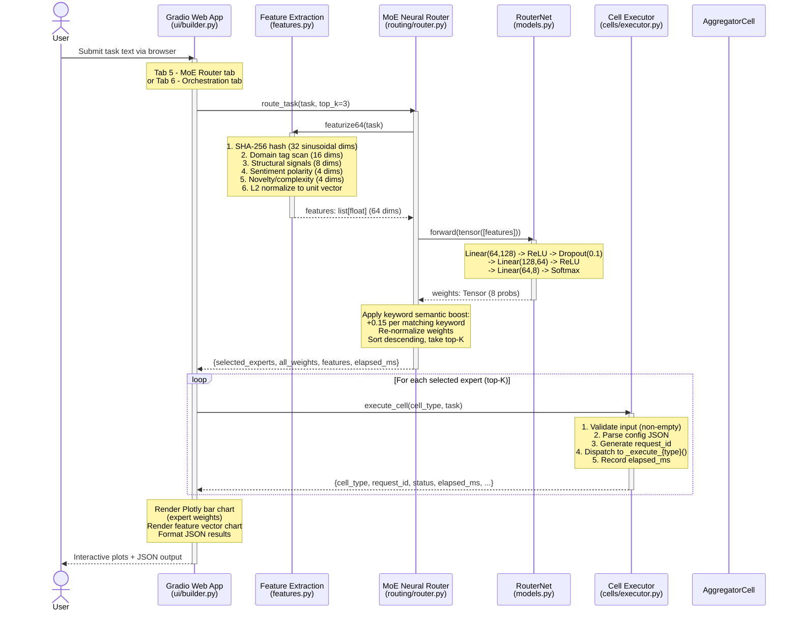
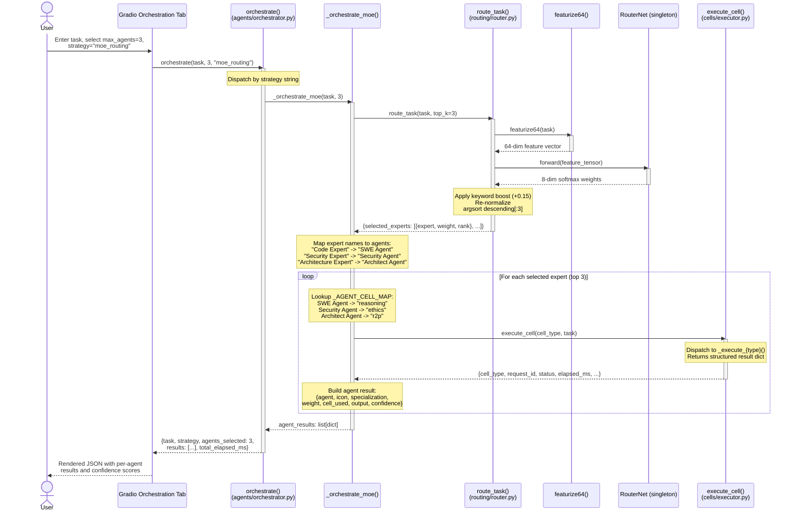
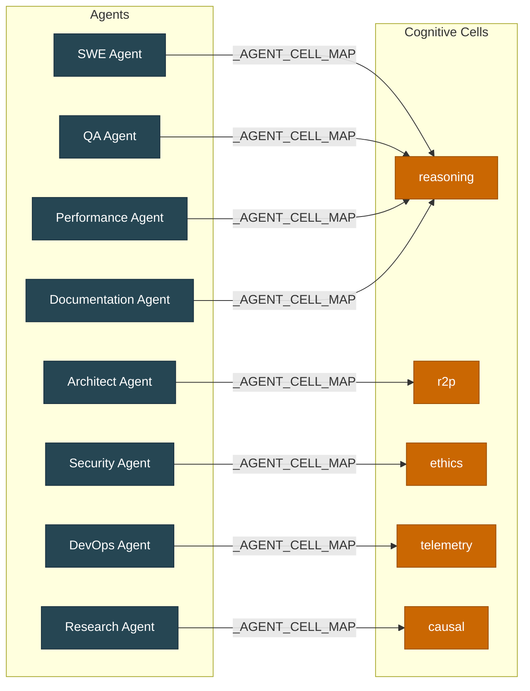
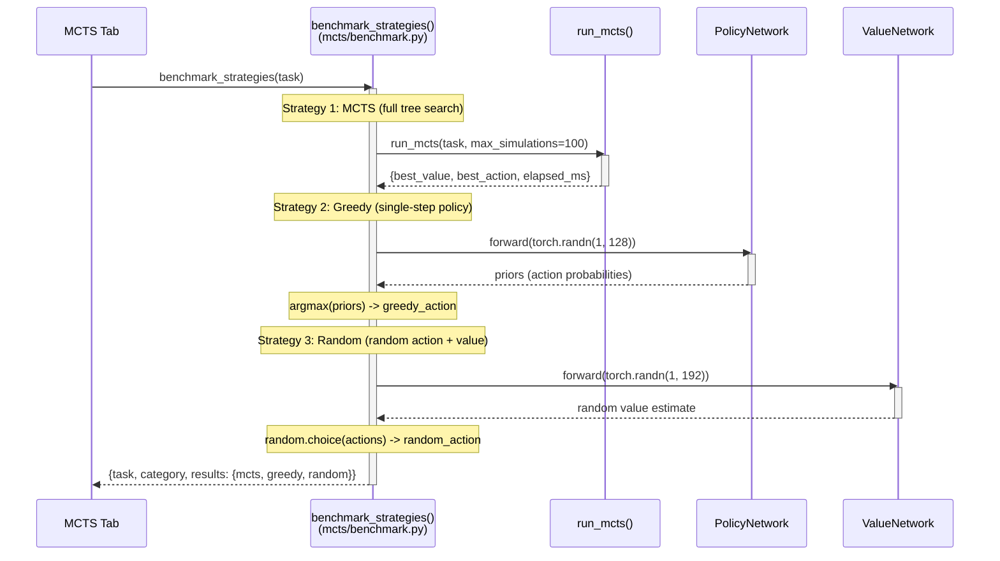

# Data Flow -- Sequence Diagrams

## Overview

This document contains three sequence diagrams that trace the primary data flows through MangoMAS Demo: (a) the full user input pipeline from Gradio to aggregated output, (b) the MCTS search cycle with expand/select/simulate/backpropagate phases, and (c) agent orchestration with MoE routing.

## (a) Full Pipeline Flow: User Input to UI Output

This diagram traces a complete request from the user entering text in the Gradio UI through feature extraction, neural routing, cell execution, and back to the rendered output.

## (b) MCTS Search Cycle

This diagram shows the internal Monte Carlo Tree Search loop with the four phases: expand, select, simulate, and backpropagate. The cycle runs for the configured number of simulations (10-500).

```mermaid
sequenceDiagram
    participant Caller as UI / Benchmark
    participant Engine as run_mcts()<br/>(mcts/engine.py)
    participant Root as MCTSNode (root)
    participant Child as MCTSNode (child)
    participant PNet as PolicyNetwork<br/>(models.py)
    participant VNet as ValueNetwork<br/>(models.py)

    Caller->>Engine: run_mcts(task, max_simulations, exploration_constant, strategy)
    activate Engine

    Note over Engine: _detect_category(task)<br/>Lookup TASK_CATEGORIES[category]<br/>Get action list (5 actions)

    Engine->>Root: Create MCTSNode(id="root", action=task[:50])
    activate Root

    rect rgb(40, 60, 80)
        Note over Engine,VNet: Simulation Loop (repeat max_simulations times)

        Note over Engine: PHASE 1: EXPAND<br/>If root has no children,<br/>create child nodes for each action

        alt First simulation (no children)
            loop For each action in category
                Engine->>PNet: forward(torch.randn(1, 128))
                activate PNet
                PNet-->>Engine: priors: Tensor (N_actions)
                deactivate PNet
                Engine->>Root: Add child MCTSNode(action, policy_prior=prior)
            end
        end

        Note over Engine: PHASE 2: SELECT<br/>Choose best child by score function

        alt strategy == "ucb1"
            Engine->>Root: For each child: ucb1_score(parent_visits, c)
            Note over Root: UCB1 = Q/n + c * sqrt(ln(N)/n)<br/>Returns inf if visits == 0
        else strategy == "puct"
            Engine->>Root: For each child: puct_score(parent_visits, c)
            Note over Root: PUCT = Q/n + c * P * sqrt(N)/(1+n)<br/>Returns inf if visits == 0
        end

        Root-->>Engine: best_child (highest score)

        Note over Engine: PHASE 3: SIMULATE<br/>Get value estimate for selected node

        Engine->>VNet: forward(torch.randn(1, 192))
        activate VNet
        Note over VNet: Linear(192,256) -> ReLU<br/>-> Linear(256,64) -> ReLU<br/>-> Linear(64,1) -> Tanh<br/>Output in [-1, 1]
        VNet-->>Engine: value: float
        deactivate VNet

        Note over Engine: PHASE 4: BACKPROPAGATE<br/>Update visit counts and values

        Engine->>Child: visits += 1
        Engine->>Child: total_value += value
        Engine->>Root: visits += 1
    end

    Note over Engine: Find best child (max visits)<br/>Compute best_value = total_value / visits

    Engine->>Root: to_dict(max_depth=2)
    Root-->>Engine: Serialized tree dict

    deactivate Root

    Engine-->>Caller: {task, category, strategy, best_action, best_value,<br/>total_simulations, tree, all_actions, elapsed_ms, nn_enabled}
    deactivate Engine
```

## (c) Agent Orchestration with MoE Routing

This diagram shows the full agent orchestration flow when using the `moe_routing` strategy. The orchestrator calls the neural router to select agents, maps each agent to a cognitive cell, executes the cells, and collects results.

## Agent-to-Cell Mapping Reference

The following table shows the fixed mapping used by the orchestrator to route each agent to its cognitive cell type:

## Benchmark Strategy Comparison Flow

The benchmark module compares three strategies on the same task:

