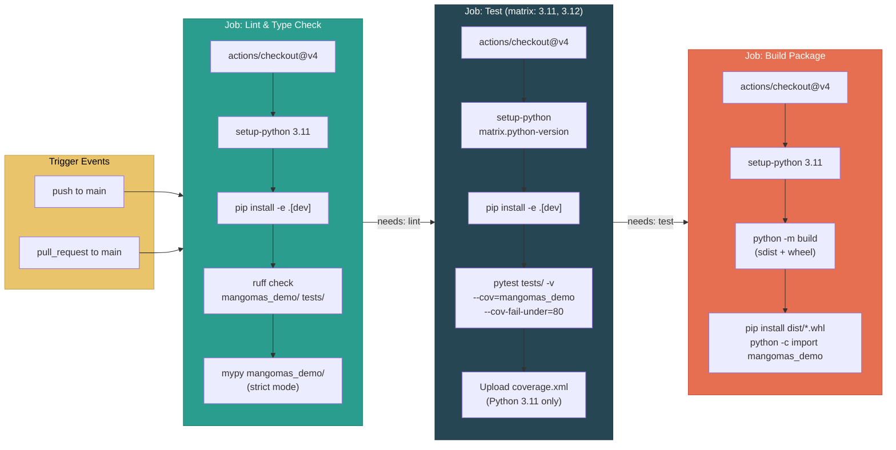
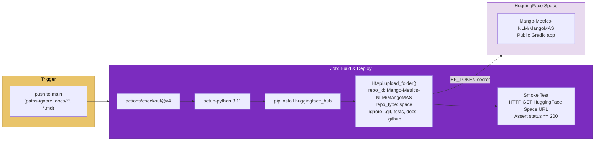
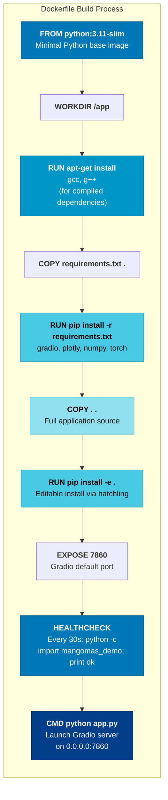
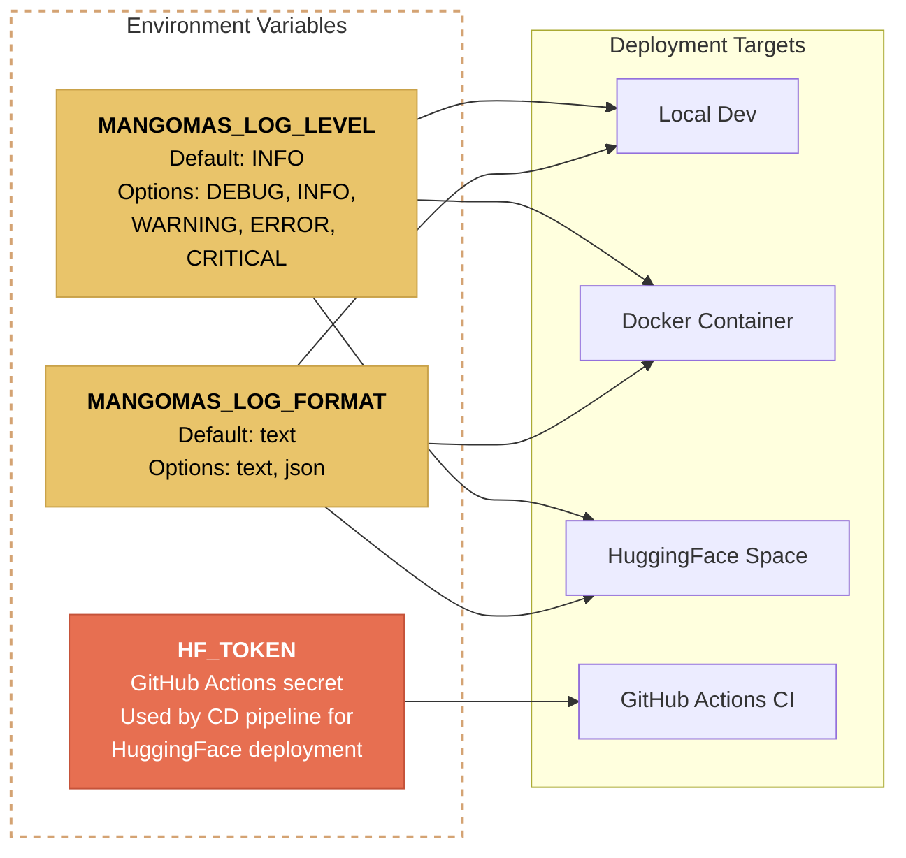
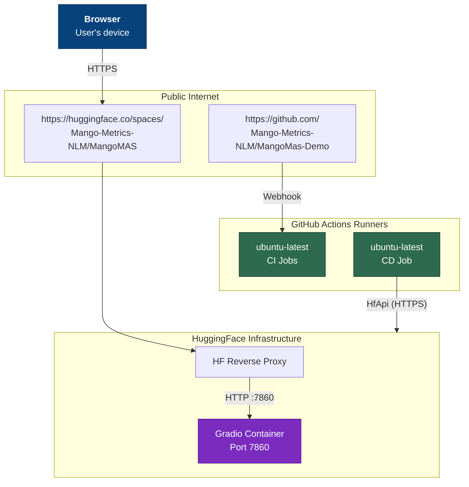

# Deployment Diagram

## Overview

This document describes the deployment topology for MangoMAS Demo across three environments: local development, Docker container, and HuggingFace Spaces. It also covers the CI/CD pipeline that automates linting, testing, building, and deployment through GitHub Actions.

## Deployment Environments

```mermaid
graph TB
    subgraph LocalDev["Local Development Environment"]
        direction TB
        DevMachine["<b>Developer Machine</b><br/><i>macOS / Linux / Windows</i>"]

        subgraph PythonLocal["Python 3.11+ Runtime"]
            AppLocal["<b>app.py</b><br/>Gradio entrypoint<br/>Port 7860"]
            PkgLocal["<b>mangomas_demo/</b><br/>Full package:<br/>features, models, cells,<br/>mcts, routing, agents, ui"]
            LogLocal["<b>Logging</b><br/>MANGOMAS_LOG_LEVEL=DEBUG<br/>MANGOMAS_LOG_FORMAT=text"]
        end

        subgraph DevDeps["Development Dependencies"]
            Ruff["ruff (linter)"]
            Mypy["mypy (type checker)"]
            Pytest["pytest + pytest-cov"]
            PreCommit["pre-commit hooks"]
        end

        DevMachine --> PythonLocal
        DevMachine --> DevDeps
    end

    subgraph DockerEnv["Docker Container"]
        direction TB
        DockerHost["<b>Docker Host</b><br/><i>Any Docker-capable machine</i>"]

        subgraph Container["python:3.11-slim Container"]
            Workdir["<b>WORKDIR /app</b>"]
            SysDeps["<b>System Deps</b><br/>gcc, g++"]
            Reqs["<b>requirements.txt</b><br/>gradio, plotly, numpy, torch"]
            AppDocker["<b>app.py</b><br/>CMD python app.py"]
            HealthCheck["<b>HEALTHCHECK</b><br/>interval=30s, timeout=10s<br/>retries=3, start-period=30s<br/>python -c import mangomas_demo"]
            Port["<b>EXPOSE 7860</b>"]
        end

        DockerHost --> Container
    end

    subgraph HFSpace["HuggingFace Spaces"]
        direction TB
        HFInfra["<b>HuggingFace Infrastructure</b><br/><i>Managed container runtime</i>"]

        subgraph SpaceRuntime["Mango-Metrics-NLM/MangoMAS Space"]
            HFApp["<b>Gradio App</b><br/>Served at public URL<br/>https://huggingface.co/spaces/<br/>Mango-Metrics-NLM/MangoMAS"]
            HFFiles["<b>Uploaded Files</b><br/>All source minus:<br/>.git, tests/, docs/,<br/>.github/, __pycache__/"]
        end

        HFInfra --> SpaceRuntime
    end

    User["<b>End User</b><br/><i>Browser</i>"]

    User -->|"http://localhost:7860"| AppLocal
    User -->|"http://host:7860"| Port
    User -->|"https://...huggingface.co/..."| HFApp

    style LocalDev fill:none,stroke:#2D6A4F,stroke-width:2px,stroke-dasharray:5
    style DockerEnv fill:none,stroke:#0077B6,stroke-width:2px,stroke-dasharray:5
    style HFSpace fill:none,stroke:#7B2CBF,stroke-width:2px,stroke-dasharray:5
    style User fill:#08427B,stroke:#052E56,color:#fff
    style PythonLocal fill:#D8F3DC,stroke:#2D6A4F
    style Container fill:#CAF0F8,stroke:#0077B6
    style SpaceRuntime fill:#E8DAEF,stroke:#7B2CBF
```

## CI/CD Pipeline

The project uses two GitHub Actions workflows: `ci.yml` for continuous integration and `cd.yml` for continuous deployment.

### CI Pipeline (ci.yml)

Triggered on every push and pull request to `main`. Three sequential jobs ensure code quality before any deployment.

### CD Pipeline (cd.yml)

Triggered only on push to `main` (excluding docs and markdown changes). Deploys to HuggingFace Spaces.

## Docker Build Stages

The `Dockerfile` uses `python:3.11-slim` as the base image with a single-stage build:

## Environment Variables

The following environment variables control runtime behavior across all deployment targets:

## Network Topology

